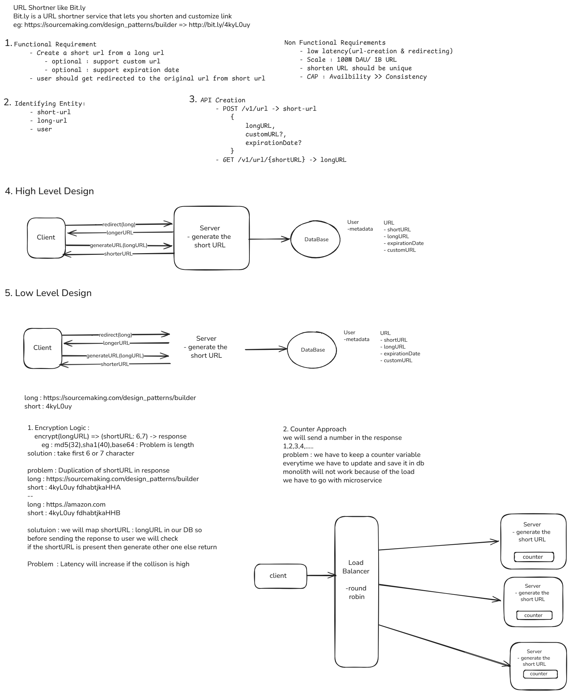

# 🏗️ System Design Vault

A curated collection of **system design notes**, **architecture diagrams**, and **engineering fundamentals** — all visualized using [Excalidraw](https://excalidraw.com/) and written in Markdown.

This repo serves as my personal reference for **interview prep**, **concept revision**, and **real-world system thinking**.

---

## 📚 Structure

Each topic lives in its own folder:
SystemDesignVault/  
├── Fundamentals/  
│ ├── CAP Theorem.md  
│ ├── Consistency Models.md  
│ └── Scalability Patterns.md  
│  
├── CaseStudies/  
│ ├── URL Shortener.md  
│ ├── Load Balancer.md  
│ ├── Messaging Queue.md  
│ └── Distributed Cache.md  
│  
├── Diagrams/  
│ ├── url_shortener.excalidraw.md  
│ ├── url_shortener.png  
│ ├── caching_architecture.excalidraw.md  
│ └── caching_architecture.png  
│  
└── Index.md

---

## 🧠 Topics Covered

### 🧩 Fundamentals
- [CAP Theorem](./Fundamentals/CAP%20Theorem.md)
- [Consistency Models](./Fundamentals/Consistency%20Models.md)
- [Scalability Patterns](./Fundamentals/Scalability%20Patterns.md)

### 🚀 Case Studies
- [URL Shortener](./CaseStudies/URL%20Shortener.md)
- [Load Balancer](./CaseStudies/Load%20Balancer.md)
- [Distributed Caching](./CaseStudies/Distributed%20Cache.md)
- [Messaging Queue](./CaseStudies/Messaging%20Queue.md)

---

## 🖼️ Visuals

All diagrams are designed in [Excalidraw](https://excalidraw.com/) and exported as PNGs for visibility on GitHub.

Example:

| Problem       | Diagram                                                |
| ------------- | ------------------------------------------------------ |
| URL Shortener |  |

---

## ⚙️ Usage

### 🔍 View Locally
1. Clone this repository: ``git clone https://github.com/yourusername/system-design-vault.git
2. Open the folder in **Obsidian**.
3.  Install **Excalidraw** plugin for interactive diagrams.

### 🌐 View Online
- **On GitHub:** Static markdown and image previews
- **(Optional)** Publish with MkDocs Material or Obsidian Publish
- 
## 🧩 Tools Used

- Obsidian — Knowledge base & Markdown editor
- Excalidraw — Visual system design diagrams
- [Git + GitHub](https://github.com/) — Version control and cloud sync
---

## 💡 Future Additions

- CDN design
- API Gateway architecture
- Rate limiting and throttling
- Authentication & Authorization systems
- Monitoring and Observability setup
