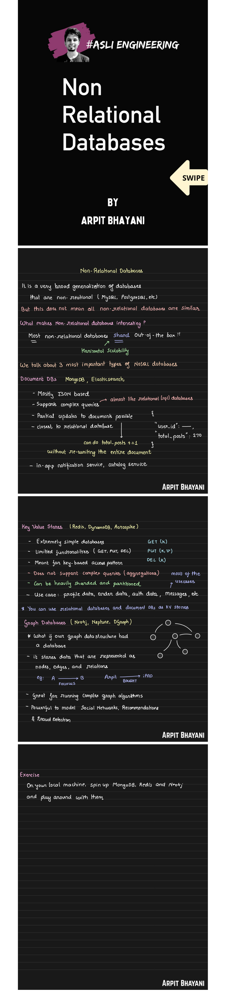

## 1. Introduction
A **Non-Relational Database (NoSQL)** is a database that does not use the traditional relational table-based structure (rows and columns with fixed schema).
NoSQL databases are designed for:
- Large-scale data storage
- Distributed systems
- High availability
- Flexible schema
- Horizontal scalability
NoSQL databases typically follow **BASE** consistency rather than strict **ACID** transactions.
---
# 2. Characteristics of NoSQL Databases
- Schema-less or flexible schema
- Horizontally scalable (scale-out architecture)
- Designed for distributed systems
- High read/write performance
- Supports unstructured and semi-structured data
---
# 3. Types of NoSQL Databases
There are **four main types**:
1. Key–Value Stores
2. Document Databases
3. Column-Family (Wide Column) Databases
4. Graph Databases
---
# 3.1 Key–Value Databases
## Definition
A Key–Value database stores data in the form:
Key → Value
The database treats the value as an opaque object.
## Structure Example
`User123 → {Name: Rahul, Age: 22}`
## Features
- Very fast lookups
- Simple structure
- Highly scalable
## Advantages
- O(1) lookup by key
- Simple design
- Excellent for caching
## Limitations
- No complex querying
- No joins
- Cannot search inside value (in most cases)
## Use Cases
- Session storage
- Caching
- User preferences
- Shopping carts
## Examples
- Redis
- Amazon DynamoDB
---
# 3.2 Document Databases
## Definition
A Document database stores data in documents (usually JSON or BSON format).
Each document:
- Has unique ID
- Contains key-value pairs
- Can have nested objects
- Does not require fixed schema
## Structure Example
`{   "id": 1,   "name": "Rahul",   "skills": ["Java", "Python"],   "address": {       "city": "Bangalore"   } }`
## Features
- Flexible schema
- Supports indexing
- Supports rich queries
## Advantages
- Easy to modify structure
- Good for evolving applications
- Developer-friendly
## Limitations
- Limited join support
- Data duplication possible
## Use Cases
- E-commerce websites
- Content management systems
- User profile systems
## Examples
- MongoDB
- CouchDB
---
# 3.3 Column-Family (Wide Column) Databases
## Definition
Data is stored in column families instead of rows.
Unlike relational databases:
- Each row can have different columns
- Columns are grouped into families
- Optimized for distributed storage
## Features
- High write performance
- Massive scalability
- Distributed architecture
## Advantages
- Handles huge data volumes
- Suitable for big data
- Good for time-series data
## Limitations
- Complex data modeling
- Limited transactional support
## Use Cases
- Logging systems
- IoT data
- Analytics platforms
- Real-time big data processing
## Examples
- Apache Cassandra
- Apache HBase
---
# 3.4 Graph Databases
## Definition
Graph databases store data as:
- Nodes (Entities)
- Edges (Relationships)
- Properties (Attributes)
Designed to efficiently handle highly connected data.
## Features
- Relationship-first model
- Fast graph traversal
- No complex joins needed
## Advantages
- Efficient for multi-level relationships
- Natural modeling of connected systems
- Good for network analysis
## Limitations
- Not ideal for heavy aggregation
- Overkill for simple CRUD apps
## Use Cases
- Social networks
- Fraud detection
- Recommendation systems
- Knowledge graphs
## Examples
- Neo4j
- Amazon Neptune
---
# 4. ACID vs BASE
## ACID (Used in RDBMS)
- Atomicity
- Consistency
- Isolation
- Durability
Ensures strong transactional guarantees.
---
## BASE (Used in NoSQL)
- Basically Available
- Soft State
- Eventually Consistent
Prioritizes availability and scalability over strict consistency.
---
# 5. CAP Theorem
CAP theorem states that a distributed system can guarantee only two of the following three:
- Consistency
- Availability
- Partition Tolerance
Most NoSQL systems choose:
- AP (Availability + Partition tolerance)  
    or
- CP (Consistency + Partition tolerance)
---
# 6. Horizontal vs Vertical Scaling
Vertical Scaling:
- Add more power (CPU, RAM) to single server.
Horizontal Scaling:
- Add more servers.
- Data is distributed using sharding.
NoSQL databases are designed for horizontal scaling.
---
# 7. Sharding
Sharding is horizontal partitioning of data across multiple servers to distribute load and improve performance.
Example:  
Users 1–1000 → Server A  
Users 1001–2000 → Server B

---
# 8. Comparison Table

| Feature     | Key-Value   | Document      | Column-Family   | Graph                |
| ----------- | ----------- | ------------- | --------------- | -------------------- |
| Structure   | Key → Value | JSON Document | Column Families | Nodes & Edges        |
| Schema      | None        | Flexible      | Semi-structured | Flexible             |
| Query Power | Low         | Medium-High   | Medium          | High (relationships) |
| Best For    | Caching     | Web apps      | Big data        | Connected data       |

---
# 9. Advantages of NoSQL
- High scalability
- Handles big data
- Flexible schema
- High availability
- Faster development
---
# 10. Disadvantages of NoSQL
- Limited transactions
- No complex joins
- Data redundancy
- Eventual consistency issues
---
# 11. Common Interview Questions (With Short Answers)
### 1) What is NoSQL?
NoSQL is a non-relational database designed for distributed data storage, flexible schema, and horizontal scalability.

---
### 2) When should you use NoSQL?
- When handling big data
- When schema changes frequently
- When high scalability is required
- When joins are not needed
---
### 3) What is eventual consistency?
Data updates will propagate to all nodes over time but not immediately.

---

### 4) What is sharding?
Sharding is splitting data across multiple machines to improve scalability.

---
### 5) Difference between MongoDB and Cassandra?
MongoDB is a document database, while Cassandra is a column-family database optimized for large distributed systems.

---
### 6) What problems are graph databases best at?
Path finding, recommendation systems, fraud detection, and social networks.

---
# 12. Short Exam Definition (4–5 lines)
Non-Relational databases (NoSQL) are distributed, schema-flexible databases designed for large-scale and high-performance applications. The main types are Key-Value, Document, Column-Family, and Graph databases. They typically follow BASE consistency and scale horizontally across multiple servers.
